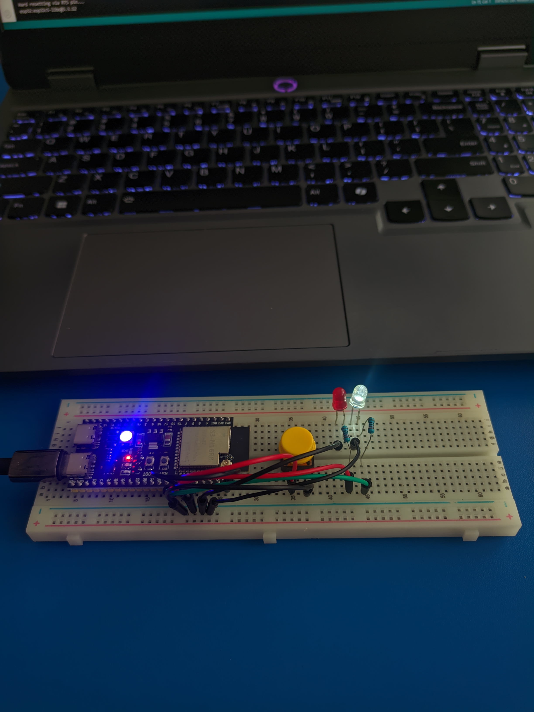
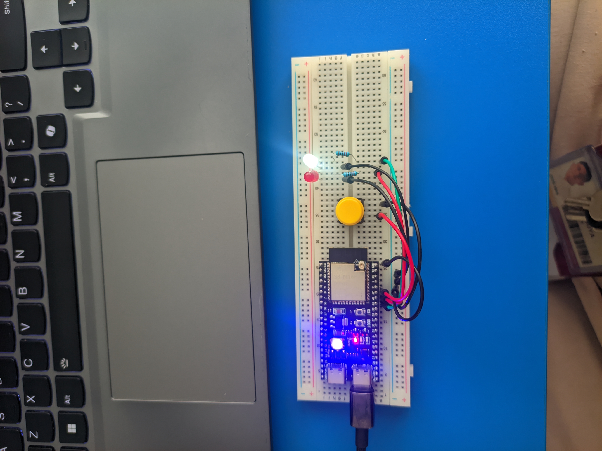

<div align="center">

# ESP32-S3 GPIO & Button Control

### Laboratory Activity 3

A simple ESP32-S3 GPIO project demonstrating **digital input**, **internal pull-up logic**, and **opposite-state LED control** using a pushbutton.

<br>


<br><br>



</div>

---

##  Overview

This laboratory activity demonstrates GPIO input and output control using an **ESP32-S3 N16R8**.

A pushbutton connected to **GPIO 42** controls two LEDs:

- The **red LED** on GPIO 41 turns ON while the button is pressed.
- The **green LED** on GPIO 40 displays the opposite state.
- When the button is released, the green LED remains ON and the red LED remains OFF.

The pushbutton uses the ESP32's built-in `INPUT_PULLUP` configuration to maintain a stable input state and prevent floating GPIO readings.

---

##  Objectives

This laboratory activity aims to:

- Configure an ESP32-S3 GPIO as a digital input.
- Configure GPIO pins as digital outputs.
- Read the state of a pushbutton.
- Understand `HIGH` and `LOW` logic when using `INPUT_PULLUP`.
- Control two LEDs with opposite states.
- Verify the expected state after resetting the microcontroller.

---

##  Hardware

| Component | Quantity | Description |
|---|:---:|---|
| ESP32-S3 N16R8 | 1 | Main microcontroller |
| Pushbutton | 1 | Digital input |
| Red LED | 1 | Pressed-state indicator |
| Green LED | 1 | Released-state indicator |
| 220 Ω Resistor | 2 | LED current limiting |
| Breadboard | 1 | Circuit assembly |
| Jumper Wires | Several | Electrical connections |
| USB Cable | 1 | Power and programming |

---

##  Pin Configuration

| Device | GPIO | Configuration |
|---|:---:|---|
| Pushbutton | `GPIO 42` | `INPUT_PULLUP` |
| Red LED | `GPIO 41` | `OUTPUT` |
| Green LED | `GPIO 40` | `OUTPUT` |

### Wiring

```text
ESP32-S3

GPIO 41 ── 220Ω ── Red LED ─── GND

GPIO 40 ── 220Ω ── Green LED ── GND

GPIO 42 ── Pushbutton ───────── GND
```

> The pushbutton does not require an external pull-up resistor because GPIO 42 uses the ESP32-S3's internal pull-up resistor.

---

##  Circuit Setup

The following image shows the physical circuit used during the laboratory activity.

<div align="center">


</div>

### Circuit Description

The circuit consists of:

- A pushbutton connected between **GPIO 42 and GND**
- A red LED connected to **GPIO 41**
- A green LED connected to **GPIO 40**
- A **220 Ω resistor** connected in series with each LED

---

##  Source Code

```cpp
#include <Arduino.h>

// GPIO connections
const uint8_t BUTTON_PIN = 42;
const uint8_t RED_LED_PIN = 41;
const uint8_t GREEN_LED_PIN = 40;

void setup() {
  // Configure the button using the ESP32's
  // internal pull-up resistor
  pinMode(BUTTON_PIN, INPUT_PULLUP);

  // Configure LEDs as outputs
  pinMode(RED_LED_PIN, OUTPUT);
  pinMode(GREEN_LED_PIN, OUTPUT);

  // Initial state:
  // Button released = Red OFF, Green ON
  digitalWrite(RED_LED_PIN, LOW);
  digitalWrite(GREEN_LED_PIN, HIGH);
}

void loop() {
  // INPUT_PULLUP logic:
  // LOW  = button pressed
  // HIGH = button released
  const bool pressed = (digitalRead(BUTTON_PIN) == LOW);

  if (pressed) {
    digitalWrite(RED_LED_PIN, HIGH);
    digitalWrite(GREEN_LED_PIN, LOW);
  } else {
    digitalWrite(RED_LED_PIN, LOW);
    digitalWrite(GREEN_LED_PIN, HIGH);
  }
}
```

The complete source code is available in:

```text
Lab3_GPIO_Button_Control.ino
```

---

##  Program Logic

The pushbutton is configured using:

```cpp
pinMode(BUTTON_PIN, INPUT_PULLUP);
```

This activates the ESP32-S3's internal pull-up resistor.

### Button Released

```text
Button Released
      │
      ▼
GPIO 42 = HIGH
      │
      ├── Red LED   = OFF
      │
      └── Green LED = ON
```

### Button Pressed

```text
Button Pressed
      │
      ▼
GPIO 42 = LOW
      │
      ├── Red LED   = ON
      │
      └── Green LED = OFF
```

---

##  Active-Low Input

The pushbutton uses an **active-low configuration**.

When the button is released, the ESP32-S3's internal pull-up resistor keeps GPIO 42 at a HIGH logic level.

```text
Released → HIGH
```

When the button is pressed, GPIO 42 is connected to GND.

```text
Pressed → LOW
```

The program detects the pressed state using:

```cpp
const bool pressed = (digitalRead(BUTTON_PIN) == LOW);
```

### Button Logic

| GPIO 42 | Button State |
|:---:|---|
| `HIGH` | Released |
| `LOW` | Pressed |

---

##  Testing Procedure

The circuit was tested using four conditions.

### Test 1 — Initial State

Power or reset the ESP32-S3 without pressing the pushbutton.

```text
Button    = Released
GPIO 42   = HIGH
Red LED   = OFF
Green LED = ON
```

### Test 2 — Button Pressed

Press and hold the pushbutton.

```text
Button    = Pressed
GPIO 42   = LOW
Red LED   = ON
Green LED = OFF
```

### Test 3 — Button Released

Release the pushbutton again.

```text
Button    = Released
GPIO 42   = HIGH
Red LED   = OFF
Green LED = ON
```

### Test 4 — Reset Test

Release the pushbutton and press the ESP32-S3 **RESET / EN** button.

```text
Red LED   = OFF
Green LED = ON
```

---

##  Observation Table

| Test | Button State | GPIO 42 | Red LED GPIO 41 | Green LED GPIO 40 | Result |
|---|---|:---:|:---:|:---:|:---:|
| Initial State | Released | HIGH | OFF | ON | PASS |
| Button Held | Pressed | LOW | ON | OFF | PASS |
| Button Released | Released | HIGH | OFF | ON | PASS |
| After Reset | Released | HIGH | OFF | ON | PASS |

---

##  Laboratory Questions

### 1. What are the GPIO connections?

The pushbutton is connected between **GPIO 42 and GND**.

The red LED is connected to **GPIO 41** through a **220 Ω resistor**.

The green LED is connected to **GPIO 40** through another **220 Ω resistor**.

---

### 2. What happens when the button is released?

GPIO 42 reads:

```text
HIGH
```

The output becomes:

```text
Red LED   = OFF
Green LED = ON
```

---

### 3. What happens when the button is pressed?

Pressing the pushbutton connects GPIO 42 to GND.

GPIO 42 therefore reads:

```text
LOW
```

The output becomes:

```text
Red LED   = ON
Green LED = OFF
```

---

### 4. What do HIGH and LOW mean for the button?

Because the pushbutton uses `INPUT_PULLUP`:

| Reading | Meaning |
|:---:|---|
| `HIGH` | Button released |
| `LOW` | Button pressed |

The pushbutton therefore uses **active-low logic**.

---

### 5. Why does the input not randomly change when released?

The ESP32-S3's internal pull-up resistor keeps GPIO 42 at a defined HIGH logic level while the pushbutton is open.

Without a pull-up or pull-down resistor, the pin could become a **floating input**, which could result in unpredictable HIGH and LOW readings.

---

### 6. What happens after resetting the board?

When the board resets, `setup()` executes again.

The initial LED states are set using:

```cpp
digitalWrite(RED_LED_PIN, LOW);
digitalWrite(GREEN_LED_PIN, HIGH);
```

Therefore:

```text
Red LED   = OFF
Green LED = ON
```

---

##  Demonstration

A physical hardware demonstration was recorded to verify the behavior of the circuit.

<div align="center">

<a href="./media/demo.mp4">
  
</a>

<br>

**Click the image above to view the demonstration video.**

</div>

The demonstration includes:

1. Initial state
2. Button released
3. Button pressed
4. Button held
5. Button released again
6. ESP32-S3 reset
7. Expected state after reset

---

##  Success Criteria

- [x] GPIO connections are correctly identified
- [x] Button input remains stable when released
- [x] Button released produces `HIGH`
- [x] Button pressed produces `LOW`
- [x] Red LED turns ON when the button is pressed
- [x] Green LED turns OFF when the button is pressed
- [x] Green LED turns ON when the button is released
- [x] Red LED turns OFF when the button is released
- [x] Both LEDs display opposite states
- [x] Reset produces the expected initial output

---

##  Repository Structure

```text
Lab-3-GPIO-Button-Control/
│
├── assets/
│   └── icons/
│       ├── book-open.svg
│       ├── cable.svg
│       ├── circle-check.svg
│       ├── circle-help.svg
│       ├── code-2.svg
│       ├── cpu.svg
│       ├── flask-conical.svg
│       ├── folder-tree.svg
│       ├── graduation-cap.svg
│       ├── image.svg
│       ├── info.svg
│       ├── table-2.svg
│       ├── target.svg
│       ├── toggle-left.svg
│       ├── video.svg
│       └── workflow.svg
│
├── media/
│   ├── circuit.jpg
│   ├── demo-thumbnail.jpg
│   └── demo.mp4
│
├── Lab3_GPIO_Button_Control.ino
└── README.md
```

---

##  Key Concepts

`ESP32-S3` • `GPIO` • `Digital Input` • `Digital Output` • `INPUT_PULLUP` • `Active-Low Logic` • `LED Control`

---

##  Conclusion

The laboratory activity successfully demonstrated digital GPIO input and output control using an ESP32-S3.

The pushbutton was configured using `INPUT_PULLUP`, creating an active-low input where **HIGH represents the released state and LOW represents the pressed state**.

The red and green LEDs were programmed to operate in opposite states. The ESP32-S3's internal pull-up resistor also prevented GPIO 42 from floating when the pushbutton was released, producing stable and predictable input readings.

---

<div align="center">

### ESP32-S3 GPIO & Button Control

**Laboratory Activity 3**

`GPIO 42` Button · `GPIO 41` Red LED · `GPIO 40` Green LED

</div>
