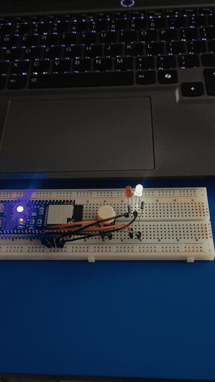

<a id="readme-top"></a>

<!-- PROJECT SHIELDS -->
<div align="center">

[![Arduino][arduino-shield]][arduino-url]
[![ESP32][esp32-shield]][esp32-url]
[![License: Academic][license-shield]][license-url]
[![GitHub last commit][commit-shield]][commit-url]

</div>

<br />

<!-- PROJECT HEADER -->
<div align="center">
  

  <h1>GPIO and Button Control with LEDs</h1>

  <p>
    <strong>Laboratory Activity 3</strong> &mdash; Opposite-state LED switching on an ESP32-S3 using an active-low pushbutton and internal pull-up resistor.
  </p>

  <p>
    <a href="#demo">View Demo</a>
    &nbsp;&middot;&nbsp;
    <a href="#circuit">Circuit Diagram</a>
    &nbsp;&middot;&nbsp;
    <a href="#source-code">Source Code</a>
    &nbsp;&middot;&nbsp;
    <a href="#observation-table">Observation Table</a>
  </p>
</div>

<br />

<!-- TABLE OF CONTENTS -->
<details>
  <summary>&nbsp; <strong>Table of Contents</strong></summary>
  <ol>
    <li><a href="#about">About the Project</a></li>
    <li><a href="#demo">Demo & Video Preview</a></li>
    <li><a href="#circuit">Circuit Schematic & Wiring</a></li>
    <li><a href="#source-code">Source Code</a></li>
    <li><a href="#high-and-low-with-input_pullup">HIGH and LOW with INPUT_PULLUP</a></li>
    <li><a href="#observation-table">Observation Table</a></li>
    <li><a href="#procedure">Laboratory Procedure</a></li>
    <li><a href="#hardware-requirements">Hardware Requirements</a></li>
    <li><a href="#getting-started">Getting Started</a></li>
    <li><a href="#license">License</a></li>
  </ol>
</details>

<br />

---

<!-- ABOUT -->
## &nbsp; About the Project

This project demonstrates digital input handling and opposite-state output switching on an ESP32-S3 microcontroller. A single tactile pushbutton on **GPIO 42** controls two status LEDs:

- **Red LED** wired to **GPIO 41**
- **Green LED** wired to **GPIO 40**

When the button is left released, the green LED stays illuminated while the red LED remains off. Pressing down on the button immediately flips their states: the red LED turns on and the green LED turns off. The two outputs consistently reflect opposing logic states.

By configuring GPIO 42 with `INPUT_PULLUP`, the microcontroller activates an internal pull-up resistor to 3.3&nbsp;V. This eliminates floating pin noise without requiring any external resistor on the breadboard.

### Built With

<p>
  
  
  
</p>

<p align="right">(<a href="#readme-top">back to top</a>)</p>

---

<!-- DEMO -->
## &nbsp; Demo

<div align="center">

  <a href="media/demo.mp4">
    
  </a>

  <br /><br />

  <p>
    <a href="media/demo.mp4">
      
    </a>
  </p>

  <p>
    <em>Figure 1: Real-time demonstration showing the red and green LEDs alternating states upon pressing and releasing the tactile switch. Click the preview or badge above to open the full high-definition video.</em>
  </p>

</div>

<p align="right">(<a href="#readme-top">back to top</a>)</p>

---

<!-- CIRCUIT -->
## &nbsp; Circuit Schematic & Wiring

<div align="center">
  
  <p><em>Figure 2: Complete breadboard assembly with labeled GPIO and power connections.</em></p>
</div>

<br />

### GPIO Pin Mapping

| Component | Pin | Configuration | Active State | Purpose |
|:---|:---:|:---:|:---:|:---|
|  **Tactile Pushbutton** | `GPIO 42` | `INPUT_PULLUP` | `LOW` (GND) | User input trigger |
|  **Red Status LED** | `GPIO 41` | `OUTPUT` | `HIGH` (3.3V) | Active indicator (pressed) |
|  **Green Status LED** | `GPIO 40` | `OUTPUT` | `HIGH` (3.3V) | Standby indicator (released) |

### Wiring Diagram

```text
ESP32-S3 Board
  │
  ├── GPIO 42 ────────── Pushbutton ────────── GND
  │
  ├── GPIO 41 ──[ 220Ω ]── Anode (+) Red LED   Cathode (-) ── GND
  │
  └── GPIO 40 ──[ 220Ω ]── Anode (+) Green LED Cathode (-) ── GND
```

> **Circuit Details:**
> - Each LED is placed in series with a 220&nbsp;Ω current-limiting resistor to protect the diode and avoid exceeding GPIO current limits.
> - One leg of the tactile switch is tied directly to GPIO 42, and the opposing diagonal leg is tied to GND.
> - The ESP32-S3 internal pull-up resistor actively holds GPIO 42 at 3.3&nbsp;V whenever the switch is unpressed.

<p align="right">(<a href="#readme-top">back to top</a>)</p>

---

<!-- SOURCE CODE -->
## &nbsp; Source Code

The full Arduino sketch is located at [`Paraguya_LabAct3_GPIO_and_Button_Control.ino`](Paraguya_LabAct3_GPIO_and_Button_Control.ino):

```cpp
#include <Arduino.h>

// GPIO pin assignments
const uint8_t BUTTON_PIN    = 42;
const uint8_t RED_LED_PIN   = 41;
const uint8_t GREEN_LED_PIN = 40;

void setup() {
  // Enable the internal pull-up resistor for the pushbutton
  pinMode(BUTTON_PIN, INPUT_PULLUP);

  // Configure LED pins as digital outputs
  pinMode(RED_LED_PIN, OUTPUT);
  pinMode(GREEN_LED_PIN, OUTPUT);

  // Deterministic startup state:
  // Button released -> Green ON, Red OFF
  digitalWrite(RED_LED_PIN, LOW);
  digitalWrite(GREEN_LED_PIN, HIGH);
}

void loop() {
  // In an active-low setup:
  // LOW  = Button pressed (connected to GND)
  // HIGH = Button released (pulled up to 3.3V)
  bool isPressed = (digitalRead(BUTTON_PIN) == LOW);

  if (isPressed) {
    // When pressed: Red ON, Green OFF
    digitalWrite(RED_LED_PIN, HIGH);
    digitalWrite(GREEN_LED_PIN, LOW);
  } else {
    // When released: Red OFF, Green ON
    digitalWrite(RED_LED_PIN, LOW);
    digitalWrite(GREEN_LED_PIN, HIGH);
  }
}
```

<p align="right">(<a href="#readme-top">back to top</a>)</p>

---

<!-- HIGH AND LOW -->
## &nbsp; HIGH and LOW with INPUT_PULLUP

Understanding the digital logic level of a mechanical switch is essential for embedded systems programming:

| Button State | Physical Circuit Path | GPIO 42 Voltage | Digital Read Value | Explanation |
|:---|:---|:---:|:---:|:---|
| **Released** | Open circuit (switch disconnected) | ~3.3 V | `HIGH` (1) | The internal pull-up resistor holds the input line high at VCC. No current flows to ground. |
| **Pressed** | Closed circuit to GND | ~0.0 V | `LOW` (0) | The mechanical contact shorts the pin to ground, pulling the voltage down and overriding the internal resistor. |

### Why `INPUT_PULLUP` Prevents Random Toggling

When a microcontroller pin is configured as a standard `INPUT` without any resistor, it sits in a high-impedance state (known as a **floating pin**). In this state, stray electromagnetic interference, electrostatic charges, and ambient electrical noise will cause the input to oscillate erratically between `HIGH` and `LOW`.

Using `INPUT_PULLUP` provides a definite default voltage (3.3&nbsp;V). As a result, the input signal remains completely stable whenever the button is released.

<p align="right">(<a href="#readme-top">back to top</a>)</p>

---

<!-- OBSERVATION TABLE -->
## &nbsp; Observation Table

The following observations confirm the circuit behavior across all operating conditions:

| Trial State | Pushbutton Condition | GPIO 42 Reading | Red LED (GPIO 41) | Green LED (GPIO 40) | Opposite Output Verified? |
|:---:|:---|:---:|:---:|:---:|:---:|
| **Initial / Boot** | Released (at reset) | `HIGH` | `LOW` (OFF) | `HIGH` (ON) | ✅ Yes |
| **Active Press** | Held pressed down | `LOW` | `HIGH` (ON) | `LOW` (OFF) | ✅ Yes |
| **Release** | Released again | `HIGH` | `LOW` (OFF) | `HIGH` (ON) | ✅ Yes |
| **Idle Stability** | Untouched for 30s | `HIGH` (Stable) | `LOW` (OFF) | `HIGH` (ON) | ✅ Yes (No float/flicker) |

**Key Findings:**
1. At power-on and after hardware reset, the board immediately initialises into the defined default state (`setup()` executes: Green ON, Red OFF).
2. The two LEDs consistently exhibit strictly inverted states, satisfying the laboratory requirement.
3. No spurious state transitions or random blinking occurred during the idle duration.

<p align="right">(<a href="#readme-top">back to top</a>)</p>

---

<!-- PROCEDURE -->
## &nbsp; Laboratory Procedure

1. **Schematic & Planning:** Sketched and labeled the pin connections on paper before applying power to avoid wiring mistakes.
2. **Circuit Assembly:** Inserted the ESP32-S3, pushbutton, two 220&nbsp;Ω resistors, and the red and green LEDs into the breadboard. Wired GPIO 42 to the switch and GPIO 41 and 40 to the LED anodes.
3. **Flashing & Reset:** Connected the board via USB, compiled the sketch in Arduino IDE, and uploaded the firmware. Pressed the onboard RST button to confirm clean startup.
4. **Behavior Verification:** 
   - Observed that the green LED lighted up initially.
   - Pressed the pushbutton; observed the red LED illuminate and the green LED extinguish immediately.
   - Released the pushbutton; observed the LEDs swap back instantly.
5. **Noise & Stability Check:** Left the switch unpressed for an extended duration to confirm that the internal pull-up prevented erratic toggling.

<p align="right">(<a href="#readme-top">back to top</a>)</p>

---

<!-- HARDWARE REQUIREMENTS -->
## &nbsp; Hardware Requirements

| Qty | Item Description | Specifications / Notes |
|:---:|:---|:---|
| 1 | ESP32-S3 Development Board | Dual-core Xtensa LX7, 3.3V logic |
| 1 | Tactile Pushbutton Switch | 6x6 mm momentary contact switch |
| 1 | Red LED | 5 mm standard through-hole LED |
| 1 | Green LED | 5 mm standard through-hole LED |
| 2 | Resistors | 220 Ω, 1/4 W carbon film |
| 1 | Solderless Breadboard | 400 or 830 tie-point breadboard |
| — | Jumper Wires | Male-to-male DuPont cables |
| 1 | USB Type-C Cable | Data & power cable |

<p align="right">(<a href="#readme-top">back to top</a>)</p>

---

<!-- GETTING STARTED -->
## &nbsp; Getting Started

### Prerequisites

- [Arduino IDE](https://www.arduino.cc/en/software) (version 2.0 or newer recommended)
- **ESP32 Board Package:** In Arduino IDE, open **Settings**, paste `https://raw.githubusercontent.com/espressif/arduino-esp32/gh-pages/package_esp32_index.json` into the Additional Board Manager URLs field, and install the **esp32** platform from the Boards Manager.

### Installation & Upload

1. Clone this repository to your local machine:
   ```sh
   git clone https://github.com/xavieryyyyyy/GPIO-Button-Control_with_LEDS.git
   ```
2. Open `Paraguya_LabAct3_GPIO_and_Button_Control.ino` in Arduino IDE.
3. Select your ESP32-S3 board model under **Tools &rarr; Board**.
4. Select the matching serial port under **Tools &rarr; Port**.
5. Click **Upload** (or press `Ctrl+U`).
6. Once flashing finishes, test the circuit by pressing the tactile pushbutton.

<p align="right">(<a href="#readme-top">back to top</a>)</p>

---

<!-- LICENSE -->
## &nbsp; License

Developed as part of **Laboratory Activity 3: GPIO and Button Control**. Academic and educational use permitted.

<p align="right">(<a href="#readme-top">back to top</a>)</p>

---

<!-- MARKDOWN DEFINITIONS -->
[arduino-shield]: https://img.shields.io/badge/Arduino-00878F?style=flat&logo=arduino&logoColor=white
[arduino-url]: https://www.arduino.cc/
[esp32-shield]: https://img.shields.io/badge/ESP32--S3-E7352C?style=flat&logo=espressif&logoColor=white
[esp32-url]: https://www.espressif.com/en/products/socs/esp32-s3
[license-shield]: https://img.shields.io/badge/License-Academic-blue?style=flat
[license-url]: #license
[commit-shield]: https://img.shields.io/github/last-commit/xavieryyyyyy/GPIO-Button-Control_with_LEDS?style=flat
[commit-url]: https://github.com/xavieryyyyyy/GPIO-Button-Control_with_LEDS/commits/main
